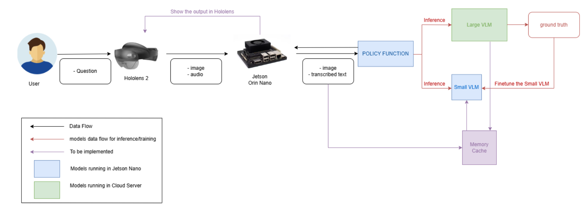

# sg-jetson-hololens-server-integration

## Contents

- [Project Setup](#project-setup)
- [Folder Structure](#folder-structure)
- [Embedded Device](#embedded-device)
- [Cloud Server](#cloud-server)

## Project Setup  



## Folder Structure

1. `jetson_client` - Contains the code to be run on the Jetson Orin Nano.
2. `workstation_server` - Contains the code to be run on the workstation.
3. `inference_code` - Contains the code for finetuning the VLM on Orin Nano on the go.
4. `docs` - Contains the documentation.

## Embedded Device  

We use **Jetson Orin Nano** as our embedded device.

### Configuration (Jetson Orin Nano)

Before you begin, make sure you have the following configuration for your environment:  

```ini
Jetson Orin Nano  
CUDA_VERSION = 11.4  
NVIDIA-JETPACK = 5.1.1-b56  
OS = Ubuntu 20.04 (Focal)  
Python Virtual Environment Version = Python 3.8.10  
GCC Compiler Version = 9.4.0  
```

### Setting up the Jetson Orin Nano Environment

1. First, check whether your Jetson Orin Nano configuration matches the above setup.

2. Clone the repository:

   ```bash
   git clone https://github.com/test-a073/sg-jetson-hololens-server-integration
   cd sg-jetson-hololens-server-integration
   ```

3. Install `python3-venv` if it is not installed:

   ```bash
   sudo apt update
   sudo apt install python3-venv
   ```

4. Create the virtual environment:

   ```bash
   python3 -m venv jetson_env
   ```

5. Activate the environment:

   ```bash
   source jetson_env/bin/activate
   ```

6. Some dependencies may need to be built from scratch. Install dependencies:

   ```bash
   pip install -r requirements.txt
   ```

## Cloud Server

The cloud server is responsible for handling computations that are offloaded from the Jetson Orin Nano. Setup instructions will be provided in a future update.
